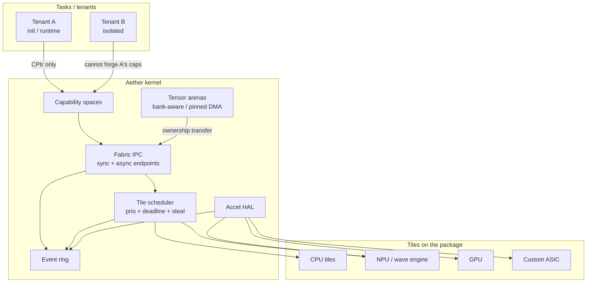

# Aether

**[Marketing site](https://amineux.github.io/aether/)** — vision, architecture
visuals, two-year roadmap. Static HTML from [`site/`](site/); published by
GitHub Actions to Pages (kernel `docs/` are untouched).

**An accelerator-first fabric kernel** — a research prototype for how operating
systems should look when the package is a mesh of CPU, NPU, GPU, and custom
ASIC tiles rather than a host CPU with bolt-on devices.

> This is **not** production silicon, not a tutorial toy, and not a claim of
> partnership with any chip vendor. It is a bootable v0.1 whose *interfaces
> and invariants* are what we would pitch to an AI-chip OS team.

```
make test         # host unit tests (caps, fabric, arenas, scheduler, SoftNPU, L)
make qemu         # boot Aether in QEMU (x86_64 ring-3 /init; embedded ramfs)
make qemu-blk     # same + virtio-blk AETHFS01 drive (seeds /init /probe)
make qemu-smp     # same + QEMU -smp 2 (INIT-SIPI / work-steal smoke)
make qemu-riscv   # RISC-V virt S-mode + U-mode /init + PLIC SoftNPU IRQ
make qemu-aarch64 # aarch64 virt EL1 + EL0 /init (svc/eret; documented subset)
make accel-test   # path-A QEMU device model (host; no QEMU rebuild)
make qemu-accel   # accel-test; attach -device aether-accel if QEMU_ACCEL is set
```

## Why this exists

Accelerators are activities on a capability fabric, not devices behind ioctl.
Traditional kernels treat GPUs and NPUs as PCIe endpoints: `ioctl`, a userspace
runtime, and a hope that the driver got cache flushing right. That model is
already strained on a discrete GPU. It breaks down on a **package** of chiplets
where:

- inference latency is a **deadline**, not a best-effort ioctl
- weights and KV caches are **multi-tenant secrets**, not files
- “shared memory” across tiles is often **not cache-coherent**
- the expensive resource is **HBM banks and NPU waves**, not CPU time slices

Aether inverts the picture. **Compute tiles are first-class peers** on a
capability-secured message fabric. CPU threads and accelerator waves are the
same kind of scheduled job. Tensor memory is an arena with explicit ownership
transfer. There is no IPC except capability-checked messages.

## Quickstart

**Host tests** (any `x86_64-unknown-linux-gnu` rustc 1.83+):

```bash
cargo test --workspace
```

**QEMU demo** (also needs `qemu-system-x86_64`, GNU `as`/`ld` with `elf_i386`,
`objcopy`, and `rustup target add x86_64-unknown-none`):

```bash
make qemu
```

Exact machine:

```bash
qemu-system-x86_64 \
  -kernel build/aether.elf \
  -serial stdio -display none \
  -no-reboot -no-shutdown -m 128M
```

You should see the trampoline enter long mode, a kernel self-check of the
host-identical fabric demo, then ring-3 `/init` over `syscall`:

```
[init] ring-3 /init (static ELF64 non-PIE @ 0x2000000)
[init] clone ok (shared aspace)
[init] user-thread share-aspace
[sched] kthread-B tick=…
FABRIC IPC + TENSOR ARENA + ACCEL JOB COMPLETE
  CUT BIND + HODGE FLOW CLASS ENFORCED
  TYPED SPACE + ACTIVITY ENDPOINT + FENCE-ORDERED JOB
  RING-3 /init VIA SYSCALL/SYSRET
```

The guest then exits QEMU via `isa-debug-exit` (status 1 means success).
`make qemu` treats that as a clean run. CI runs `make qemu-ci` (45s timeout).
The kernel self-check also prints `[blast] two-tenant blast radius sealed`
(CrossCut + wrong-SID refuse). A one-week diligence clip, not a track.
See [`docs/BLAST.md`](docs/BLAST.md).

**RISC-V virt** (`qemu-system-riscv64`, `rustup target add riscv64gc-unknown-none-elf`):

```bash
make qemu-riscv
```

```
qemu-system-riscv64 \
  -machine virt -cpu rv64 -m 128M -nographic \
  -no-reboot -kernel build/aether-riscv.elf
```

OpenSBI loads the ELF at `0x80200000`. The trampoline identity-maps
4 GiB (Sv39), the same kernel self-check runs, then `sret` drops to
U-mode `/init` at `0x82000000` (`ecall` syscalls, own satp). SoftNPU
is the in-kernel virtqueue (path B). Completions are claimed on the
**PLIC** (UART THRE software doorbell, source 10) — not a virtio-mmio
`-device`. This is a **documented subset**, not a product-class
second architecture. Success writes `0x5555` to the virt test
finisher. `make qemu-riscv-ci` greps `[plic] claim irq=10 SoftNPU
used-ring` plus `[init] U-mode /init` and `U-MODE /init VIA ECALL/SRET`.

**aarch64 virt** (`qemu-system-aarch64`, `rustup target add aarch64-unknown-none`):

```bash
make qemu-aarch64
```

```
qemu-system-aarch64 \
  -machine virt,gic-version=2 -cpu cortex-a72 -m 128M -nographic \
  -no-reboot -nic none -kernel build/aether-aarch64.elf -semihosting
```

QEMU loads the ELF at `0x40080000`. The trampoline identity-maps
4 GiB (TTBR0, 1 GiB blocks), the same kernel self-check runs, then
`eret` drops to EL0 `/init` at `0x42000000` (`svc` syscalls, own
TTBR0). SoftNPU is the in-kernel virtqueue (path B), drained on the
CNTV tick / kthread poll — not a GIC doorbell and not virtio-mmio.
This is a **documented subset**, not a product-class second
architecture. Success is Angel semihosting `SYS_EXIT`.
`make qemu-aarch64-ci` greps `[init] EL0 /init` and
`EL0 /init VIA SVC/ERET`.

## Architecture



| Piece | Role in v0.1 |
| --- | --- |
| **Fabric IPC** | seL4-inspired caps; sync/async endpoints; cap grants; chiplet route tags; `FlowClass` + Hodge quotas |
| **Tile scheduler** | CPU `Thread` and NPU `AccelWave` jobs; priority + deadline boost; bank affinity; work-steal; **SpectralCut** placement refusal |
| **Tensor arenas** | NUMA/bank first-fit; 4K / 2M align; pinned DMA; explicit owner tile/tenant |
| **Accel HAL** | `probe / submit / poll / map`; virtqueue MMIO + SoftNPU (I32 + software F16/F32); SoftCommandProcessor (`CpCmd`); IreeShapedCp (`IreeHalCmd`, IREE HAL nouns, `backend = 4`); Soft SMMU IOVAs; `(place, local)` map refuses silent remote load |
| **Typed spaces** | `HOST \| DEVICE_HBM \| TILE_SRAM \| CXL_REGION \| SCRATCH \| STREAMING`; UNIFIED is a cap bit. `TypedWindow` is a CXL.mem-inspired pin stub (not silicon) |
| **Activity / partition / fence** | Uniform endpoint; spatial slice + QoS + blast radius; submit → wait → complete (CP-shaped seq; timeout is software) |
| **Caps** | Unforgeable `CPtr` slots; monotonic derive; cross-tenant mint rejected; revoke empties descendants |
| **Observability** | COM1 console + structured `EventRing` |

## Repository layout

```
boot/x86_64/     multiboot1 trampoline (32-bit → long mode) + linker scripts
boot/riscv64/    OpenSBI S-mode trampoline + Sv39 linker script
boot/aarch64/    QEMU virt EL1 trampoline + TTBR0 linker script
core/            aether-core — alloc-free logic, `cargo test`
hal/             AccelDevice / Console / Timer traits
drivers/         VirtIO-Accel queue + SoftNPU + SoftCommandProcessor + IreeShapedCp
qemu/            optional path-A `aether-accel` device (host-tested; QEMU patch)
host/aether-pjrt std host shim: abi nouns → IreeHalCmd → IreeShapedCp (SoftNPU = qemu demo)
kernel/          freestanding kernel (x86_64 ring-3 + riscv64 U-mode /init + aarch64 EL0 /init)
user/init/       `/init` (static ELF64; x86 @ 0x2000000, riscv @ 0x82000000, aarch64 @ 0x42000000)
user/probe/      optional second static ELF64 (own PML4 @ 0x2400000)
docs/            architecture, fabric, accel, security, diligence, roadmap
```

The kernel and `/init` are **separate Cargo projects** so
`cargo test --workspace` stays on the host. `make qemu` builds both for
`x86_64-unknown-none` and embeds the init ELF.

## What v0.1 is honest about

- **Research prototype.** Soft SMMU (software STE→CD→Stage-1/2 IOVA
  walk + ATS-shaped invalidate) is in tree; there is no hardware SMMU,
  no verified cap derivation tree, no real silicon driver. Hardware
  SMMU still requires partner silicon. `TypedWindow` (`CxlMemStub`) is
  a CXL.mem-inspired pin stub, not a HDM decoder and not QEMU CXL.
  SMP is a QEMU `-smp 2` smoke
  (INIT-SIPI, per-CPU `gs`, two-hart work-steal); APs do not run `/init`.
- **VirtIO-Accel path B is an in-kernel MMIO virtqueue**, not a tree in
  upstream QEMU. `make qemu` stays on that BAR so the demo does not
  depend on a custom qemu. DMA uses Soft-SMMU IOVAs (not identity);
  QEMU does not emulate a hardware SMMU. Path A is an optional
  in-tree QEMU device (`qemu/aether_accel.c`, same frozen offsets)
  with a host unit test (`make accel-test`). `make qemu-accel` attaches
  `-device aether-accel` only when `QEMU_ACCEL` names a patched
  binary; CI does not rebuild QEMU. See [qemu/README.md](qemu/README.md).
- **`/init` is a static non-PIE ELF64** linked at `0x0200_0000`. Boot
  seeds an in-kernel ramfs from **virtio-blk** (`make qemu-blk` /
  `qemu-blk-ci`, AETHFS01 image) or the embedded blob when no drive
  is present (`make qemu-ci`). The loader opens `/init` (and x86
  `/probe`) by name. Not POSIX. SoftNPU path B is unchanged.
  Ring-3 entry is `syscall`/`sysret`; cap checks sit on send/recv/map/accel.
- **Per-task PML4 + higher-half + KASLR are documented subsets.** Each
  ring-3 task has its own CR3; USER is only on that task's 2 MiB ELF
  window; SMEP/SMAP are on. The kernel is linked at
  `0xffffffff80400000` (classic `-2 GiB` map). The trampoline picks a
  0 / 16 / 32 MiB slide (`-append kaslr=1` in CI), dual-maps an 8 MiB
  kernel span, applies `.rela.dyn` (`R_X86_64_RELATIVE`), unmaps the
  unused link-time alias, and runs at the slid RIP. Kernel CR3
  identity is torn down except SIPI / mailbox / trampoline /
  virtio-blk / APIC islands. SoftNPU DMA is Soft SMMU + HH
  (`KernelDma`). User CR3 is a KPTI subset: ELF window + 4 KiB
  supervisor trampoline, no HH, no identity DMA. PCID tags those CR3 switches
  when the CPU advertises it (`-cpu qemu64,+pcid,+invpcid`);
  otherwise `mov cr3` still full-flushes. One shared 4 KiB COW page
  (`0x0280_0000`) is read-only in `/init` and `/probe` until a write
  fault. `SYS_MMAP` (nr 11) grows the caller aspace with anonymous
  4 KiB USER pages in a reserved window (not POSIX `mmap`).
  Not Meltdown-complete / a secret slide / POSIX `mmap`.
  SMP is a QEMU `-smp 2` smoke; APs do not run `/init`.
  `make qemu-smp` proves two harts; `make qemu` stays uniprocessor.
- **RISC-V userspace is a documented subset.** `make qemu-riscv`
  `sret`s into U-mode `/init` over `ecall` with a task-local Sv39
  window. SoftNPU is in-kernel path B; used-ring completions go
  through a PLIC software doorbell (not virtio-mmio). aarch64
  `eret`s into EL0 `/init` over `svc` with a task-local TTBR0
  window (in-kernel SoftNPU; no GIC doorbell). Neither is a
  product-class second architecture.

See [docs/ROADMAP.md](docs/ROADMAP.md) and
[docs/SIX_MONTH_PLAN.md](docs/SIX_MONTH_PLAN.md) for landed status.
The Month 1–2 spine (opcodes → PJRT shim) is done. Soft-CP now has two
software XQueues (queue-boundary suspend/resume; not a silicon queuing
unit). Optional Soft SMMU kit / path-A guest bind stay gated. SID-at-submit
can stamp the queue SID already hooked on Soft-CP.

## Docs

- [docs/ARCHITECTURE.md](docs/ARCHITECTURE.md) — thesis, boot, modules
- [docs/ABI.md](docs/ABI.md) — PJRT/IREE-shaped host objects; no in-kernel graph IR
- [docs/HOST.md](docs/HOST.md) — partner compiler contract (`aether-pjrt`); not a plugin
- [docs/FABRIC.md](docs/FABRIC.md) — messages, endpoints, route tags, Hodge class
- [docs/CUT.md](docs/CUT.md) — SpectralCut + AffinityLaplacian + Hodge
- [docs/BLAST.md](docs/BLAST.md) — two-tenant blast-radius diligence clip (CrossCut + wrong-SID refuse)
- [docs/ACCEL.md](docs/ACCEL.md) — HAL, virtqueue MMIO, map API, bank color, how to plug a real NPU
- [docs/SECURITY.md](docs/SECURITY.md) — cap invariants, tenant isolation
- [docs/DILIGENCE.md](docs/DILIGENCE.md) — what ships, stubs, partner pitch
- [docs/DEEP_DIVE_AGENDA.md](docs/DEEP_DIVE_AGENDA.md) — 60–90 min silicon agenda
- [docs/ROADMAP.md](docs/ROADMAP.md) — landed status, stubs, technical leftovers
- [docs/SIX_MONTH_PLAN.md](docs/SIX_MONTH_PLAN.md) — Falsifier spine (M1 `IreeShapedCp` + M2 `aether-pjrt` landed; optional Soft SMMU kit / path A gated)
- [docs/YEAR2_PLAN.md](docs/YEAR2_PLAN.md) — historical Falsifier track through PR #37 + SpecForge appendix

## Website

The public site lives in [`site/`](site/) (HTML/CSS/JS, no build step) and
deploys from `.github/workflows/pages.yml` on pushes to `main` that touch
`site/`. After the first successful run, enable **Settings → Pages → Source:
GitHub Actions** if it is not already on. The live URL is
[https://amineux.github.io/aether/](https://amineux.github.io/aether/).

Open `site/index.html` locally, or `python3 -m http.server -d site`, to
review offline.

## License

MIT OR Apache-2.0.
