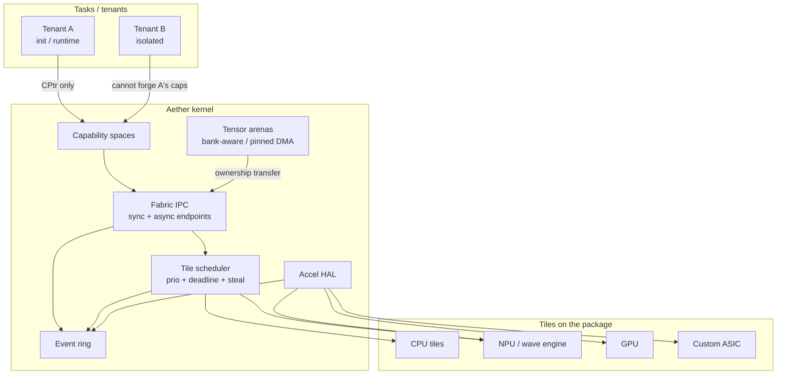

# Aether

**[Marketing site](https://amineux.github.io/aether/)** — vision, architecture
visuals, two-year roadmap. Static HTML from [`site/`](site/); published by
GitHub Actions to Pages (kernel `docs/` are untouched).

**An accelerator-first fabric kernel** — a research prototype for how operating
systems should look when the package is a mesh of CPU, NPU, GPU, and custom
ASIC tiles rather than a host CPU with bolt-on devices.

> This is **not** production silicon, not a tutorial toy, and not a claim of
> partnership with any chip vendor. It is a bootable v0.1 whose *interfaces
> and invariants* are what we would pitch to an AI-chip OS team.

```
make test         # host unit tests (caps, fabric, arenas, scheduler, SoftNPU, L)
make qemu         # boot Aether in QEMU (x86_64 ring-3 /init)
make qemu-smp     # same + QEMU -smp 2 (INIT-SIPI / work-steal smoke)
make qemu-riscv   # same aether_core self-check on QEMU virt (thin S-mode port)
make qemu-aarch64 # same self-check on QEMU virt (thin EL1 port, no EL0)
```

## Why this exists

Accelerators are activities on a capability fabric, not devices behind ioctl.
Traditional kernels treat GPUs and NPUs as PCIe endpoints: `ioctl`, a userspace
runtime, and a hope that the driver got cache flushing right. That model is
already strained on a discrete GPU. It breaks down on a **package** of chiplets
where:

- inference latency is a **deadline**, not a best-effort ioctl
- weights and KV caches are **multi-tenant secrets**, not files
- “shared memory” across tiles is often **not cache-coherent**
- the expensive resource is **HBM banks and NPU waves**, not CPU time slices

Aether inverts the picture. **Compute tiles are first-class peers** on a
capability-secured message fabric. CPU threads and accelerator waves are the
same kind of scheduled job. Tensor memory is an arena with explicit ownership
transfer. There is no IPC except capability-checked messages.

## Quickstart

**Host tests** (any `x86_64-unknown-linux-gnu` rustc 1.83+):

```bash
cargo test --workspace
```

**QEMU demo** (also needs `qemu-system-x86_64`, GNU `as`/`ld` with `elf_i386`,
`objcopy`, and `rustup target add x86_64-unknown-none`):

```bash
make qemu
```

Exact machine:

```bash
qemu-system-x86_64 \
  -kernel build/aether.elf \
  -serial stdio -display none \
  -no-reboot -no-shutdown -m 128M
```

You should see the trampoline enter long mode, a kernel self-check of the
host-identical fabric demo, then ring-3 `/init` over `syscall`:

```
[init] ring-3 /init (static ELF64 non-PIE @ 0x2000000)
[sched] kthread-B tick=…
FABRIC IPC + TENSOR ARENA + ACCEL JOB COMPLETE
  CUT BIND + HODGE FLOW CLASS ENFORCED
  TYPED SPACE + ACTIVITY ENDPOINT + FENCE-ORDERED JOB
  RING-3 /init VIA SYSCALL/SYSRET
```

The guest then exits QEMU via `isa-debug-exit` (status 1 means success).
`make qemu` treats that as a clean run. CI runs `make qemu-ci` (45s timeout).

**RISC-V virt** (`qemu-system-riscv64`, `rustup target add riscv64gc-unknown-none-elf`):

```bash
make qemu-riscv
```

```
qemu-system-riscv64 \
  -machine virt -cpu rv64 -m 128M -nographic \
  -no-reboot -kernel build/aether-riscv.elf
```

OpenSBI loads the ELF at `0x80200000`. The trampoline identity-maps
4 GiB (Sv39), then the same kernel self-check runs (fabric, cut, map,
bank color, Laplacian). This is a **thin port**: kmain + serial +
`aether_core`, not ring-3. Success writes `0x5555` to the virt test
finisher.

**aarch64 virt** (`qemu-system-aarch64`, `rustup target add aarch64-unknown-none`):

```bash
make qemu-aarch64
```

```
qemu-system-aarch64 \
  -machine virt,gic-version=2 -cpu cortex-a72 -m 128M -nographic \
  -no-reboot -nic none -kernel build/aether-aarch64.elf -semihosting
```

QEMU loads the ELF at `0x40080000`. The trampoline identity-maps
4 GiB (TTBR0, 1 GiB blocks), then the same kernel self-check runs.
This is a **thin port**: kmain + serial + `aether_core`, not EL0.
Success is Angel semihosting `SYS_EXIT`. Not a product-class second
architecture.

## Architecture



| Piece | Role in v0.1 |
| --- | --- |
| **Fabric IPC** | seL4-inspired caps; sync/async endpoints; cap grants; chiplet route tags; `FlowClass` + Hodge quotas |
| **Tile scheduler** | CPU `Thread` and NPU `AccelWave` jobs; priority + deadline boost; bank affinity; work-steal; **SpectralCut** placement refusal |
| **Tensor arenas** | NUMA/bank first-fit; 4K / 2M align; pinned DMA; explicit owner tile/tenant |
| **Accel HAL** | `probe / submit / poll / map`; virtqueue MMIO + SoftNPU; SoftCommandProcessor (`CpCmd`); Soft SMMU IOVAs; `(place, local)` map refuses silent remote load |
| **Typed spaces** | `HOST \| DEVICE_HBM \| TILE_SRAM \| CXL_REGION \| SCRATCH \| STREAMING`; UNIFIED is a cap bit |
| **Activity / partition / fence** | Uniform endpoint; spatial slice + QoS + blast radius; submit → wait → complete (CP-shaped seq; timeout is software) |
| **Caps** | Unforgeable `CPtr` slots; monotonic derive; cross-tenant mint rejected; revoke empties descendants |
| **Observability** | COM1 console + structured `EventRing` |

## Repository layout

```
boot/x86_64/     multiboot1 trampoline (32-bit → long mode) + linker scripts
boot/riscv64/    OpenSBI S-mode trampoline + Sv39 linker script
boot/aarch64/    QEMU virt EL1 trampoline + TTBR0 linker script
core/            aether-core — alloc-free logic, `cargo test`
hal/             AccelDevice / Console / Timer traits
drivers/         VirtIO-Accel queue + SoftNPU + SoftCommandProcessor
kernel/          freestanding kernel (x86_64 ring-3 + riscv64/aarch64 thin ports)
user/init/       ring-3 `/init` (static ELF64, embedded into the kernel)
user/probe/      optional second static ELF64 (own PML4 @ 0x2400000)
docs/            architecture, fabric, accel, security, diligence, roadmap
```

The kernel and `/init` are **separate Cargo projects** so
`cargo test --workspace` stays on the host. `make qemu` builds both for
`x86_64-unknown-none` and embeds the init ELF.

## What v0.1 is honest about

- **Research prototype.** Soft SMMU (software stream-ID IOVA map) is in
  tree; there is no hardware SMMU, no verified cap derivation tree, no
  real silicon driver. SMP is a QEMU `-smp 2` smoke (INIT-SIPI, per-CPU
  `gs`, two-hart work-steal); APs do not run `/init`.
- **VirtIO-Accel is an in-kernel MMIO virtqueue**, not a tree in upstream QEMU.
  `submit` kicks a doorbell; SoftNPU services the queue on the used-ring IRQ
  path so the demo does not depend on a custom qemu. DMA uses Soft-SMMU
  IOVAs (not identity); QEMU does not emulate a hardware SMMU.
- **`/init` is a static non-PIE ELF64** linked at `0x0200_0000` and **embedded
  as a kernel blob** (`build/init.elf`). There is no ramfs or virtio-blk yet.
  Ring-3 entry is `syscall`/`sysret`; cap checks sit on send/recv/map/accel.
- **Per-task PML4 is a documented subset.** Each ring-3 task has its
  own CR3; USER is only on that task's 2 MiB ELF window; SMEP/SMAP
  are on. Kernel mappings are still the trampoline identity 4 GiB
  (no higher-half / KPTI). SMP is a QEMU `-smp 2` smoke; APs do not
  run `/init`. `make qemu-smp` proves two harts; `make qemu` stays
  uniprocessor.
- **RISC-V and aarch64 are thin ports.** `make qemu-riscv` and
  `make qemu-aarch64` reach kmain and the fabric self-check. No
  userspace, no virtio. Neither is a product-class second
  architecture.

See [docs/ROADMAP.md](docs/ROADMAP.md) for the path toward something a silicon
team could take into bring-up.

## Docs

- [docs/ARCHITECTURE.md](docs/ARCHITECTURE.md) — thesis, boot, modules
- [docs/ABI.md](docs/ABI.md) — PJRT/IREE-shaped host objects; no in-kernel graph IR
- [docs/FABRIC.md](docs/FABRIC.md) — messages, endpoints, route tags, Hodge class
- [docs/CUT.md](docs/CUT.md) — SpectralCut + AffinityLaplacian + Hodge
- [docs/ACCEL.md](docs/ACCEL.md) — HAL, virtqueue MMIO, map API, bank color, how to plug a real NPU
- [docs/SECURITY.md](docs/SECURITY.md) — cap invariants, tenant isolation
- [docs/DILIGENCE.md](docs/DILIGENCE.md) — what ships, stubs, partner pitch
- [docs/DEEP_DIVE_AGENDA.md](docs/DEEP_DIVE_AGENDA.md) — 60–90 min silicon agenda
- [docs/ROADMAP.md](docs/ROADMAP.md) — Month 1–6 status, stubs, next cuts

## Website

The public site lives in [`site/`](site/) (HTML/CSS/JS, no build step) and
deploys from `.github/workflows/pages.yml` on pushes to `main` that touch
`site/`. After the first successful run, enable **Settings → Pages → Source:
GitHub Actions** if it is not already on. The live URL is
[https://amineux.github.io/aether/](https://amineux.github.io/aether/).

Open `site/index.html` locally, or `python3 -m http.server -d site`, to
review offline.

## License

MIT OR Apache-2.0.
